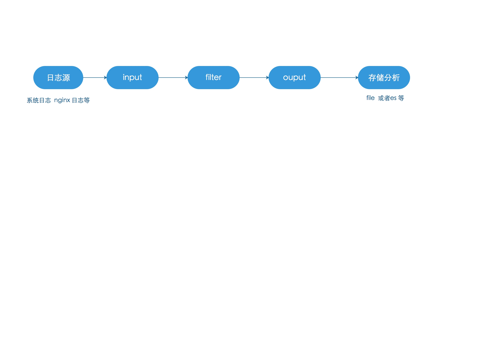

## logstash  

     logstash 是一款具有实时流水线功能的开源数据收集引擎。logstash 可以动态统一来自不同来源的数据，并将数据归一化到你选择的目的地。清理和民主化您的所有数据，以获得各种先进的下游分析和可视话用例。 
    
    什么是logstash？
    开源的日志收集引擎，具备实时传输的能力
    读取不同的数据源，并进行过滤，开发者自定义规范输出的目的地
    日志开源多(如系统日志 应用日志  服务器日志等)
    
    设置文件
     logstash.yml 
         包含logstash 配置标志，任何标志都会覆盖logstash.yaml 文件中的相应设置
     jvm.options 
         设置JVM 配置
     startup.options 
          包含使用的选项system-install在脚本中/usr/share/logstash/bin 建立相应的启动脚本为你的系统。可以安装多个实例
                  
   
    流程讲解

    logstash通过管道pipline进行传输，必选的两个组件是输入input和输出output，还有个可选过滤器filter logstash 将数据流中等每一条数据称之为event，即读取每一行数据的行为叫做事件 
    
    输入 
    input {
      ...
       }
    
    过滤器
    filter {
      ...
       }
          
    输出
    output {
       ...
      } 
  
### logstash 
     
     有输入插件，输出插件，筛选器插件和编码器插件
     插件的配置包含插件的名称，后跟该插件的一组设置，例如输入插件
	     input {
		  file {
		    path => "/var/log/messages"
		    type => "syslog"
		  }
		
		  file {
		    path => "/var/log/apache/access.log"
		    type => "apache"
		    }
		  }
	   
	    在本例子中，为每个文件输入配置了两个设置: 路径和类型
	    
	    
	   
	      
  
  
   
     
      
  