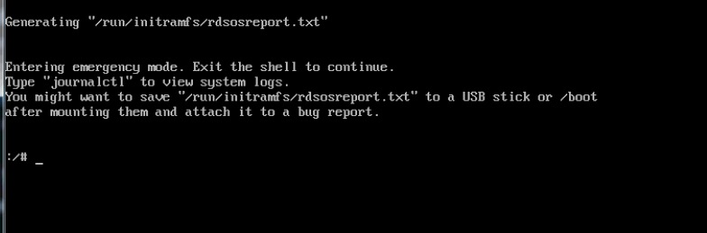
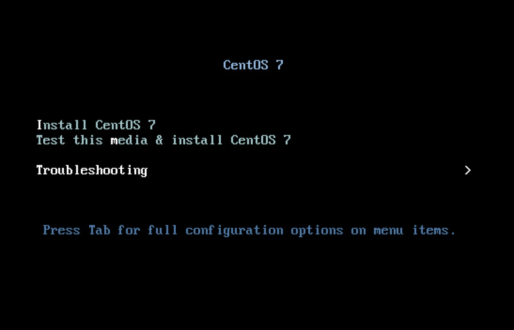
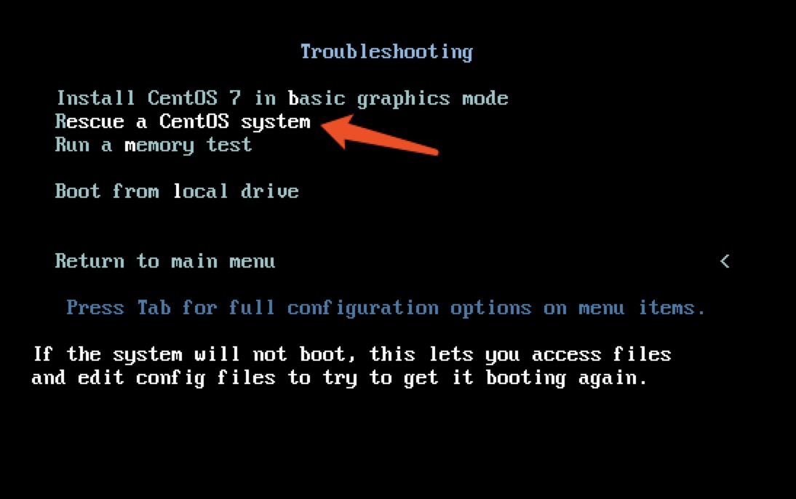
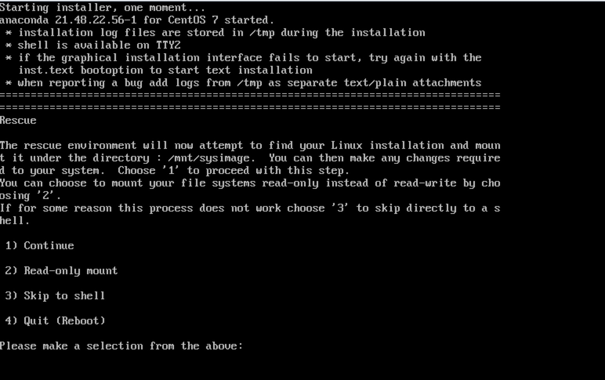
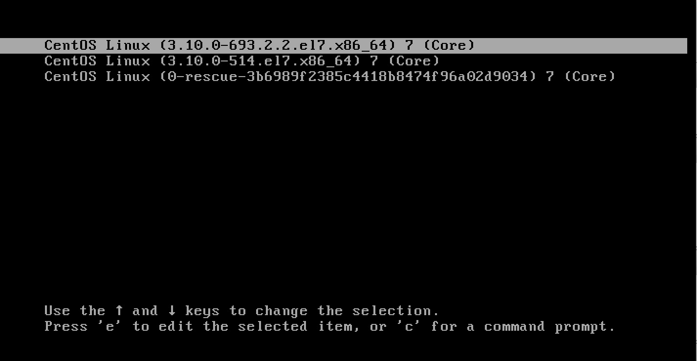
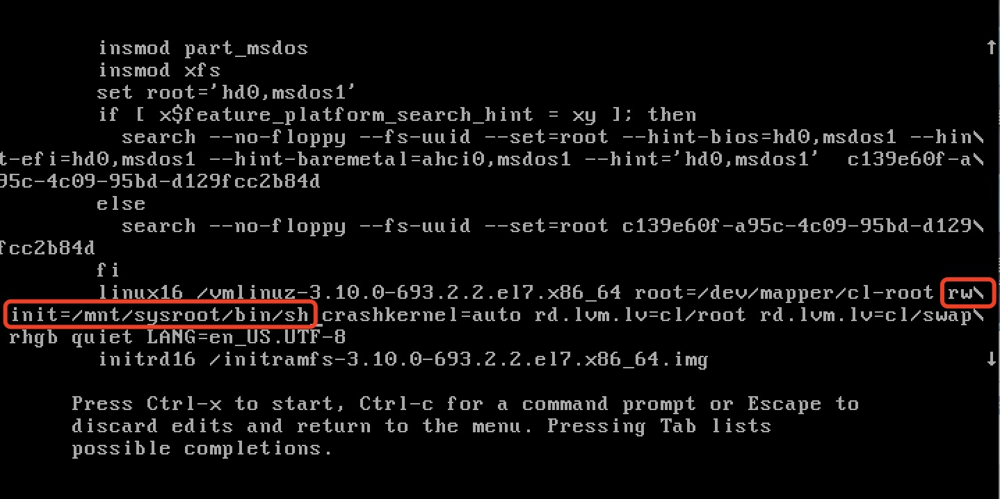
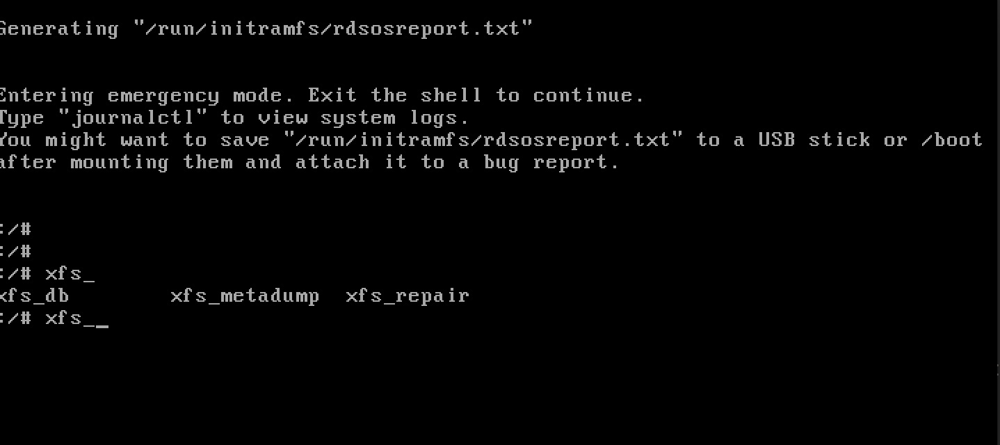

### centos 7 系统恢复 
    
### 故障描述 
     1. 启动之后操作系统只能进入到单用户模式 
   
   
     2. 使用U盘进入救援模式进行恢复 
   
   
       选择Troubleshooting 
       
   
   
       选择Rescue   a   Centos system 
       
   
         
    选择1 continue 
    但是选择这个之后就一直卡在这里不动，很奇怪不知道怎么回事
    
    重启系统进入centos 7 单用户模式，于是修改启动项，
   
    
    按e进入如下界面，原来是ro 编辑ro  为rw imit=/sysroot/bin/sh 完成后直接按ctrl+x   
   
   
   
### 文件系统修复
    
    进入单用户模式下，chroot /sysroot 报错，使用命令行挂载试试 
    mount –o remount,rw /sysroot 
    chroot  /sysroot 
    
    还是报错，怀疑文件系统有问题，因为centos 7 默认是xfs 文件系统，所以使用xfs 文件的修复工具进行修复。
    执行xfs 看到我还有三个命令可用
  
    
    xfs 相关命令介绍
    xfs_db 调试或检测xfs 文件系统(查看文件系统碎片等)
    xfs_metadump 将xfs文件系统的元数据拷贝到
    xfs_repair 尝试修复受损的xfs 文件系统
    
    xfs_repair -n /dev/dm-0   检查不修复
    因为根分区/dev/sda1 对应的实际是/dev/dm-0  
    
    如果是日志和数据不一致了，xfs 默认会在挂载的时候修复这种不一致，操作系统给出的建议是以读写的方式挂载并自动修复，可以尝试以只读不修复方式挂载文件系统。
    
    mount  -o  ro,norecovery   /dev/dm-0   /data0   
    
    如果不能以读写挂载不成功，可以清除日志再挂载 
    
    xfs_repair   -L   /dev/dm-0    
    
    清除日志有风险，可以在操作前将数据备份一下。 
    
    
    最后冒了一次风险执行
    xfs_repair   -L   /dev/dm-0  
    然后reboot   重启就好了 
    
    
    造成故障原因：
    重启设备或者断电造成linux 内核崩溃和系统停止，使xfs 调用堆栈及内核崩溃的。 
    报错如下：
    
    xfs:xfs_error_report+0xf/0x58
    
    
    
    
    
    
    
    
    
    
    
    
    
    
    
    
    
    
    
     
   