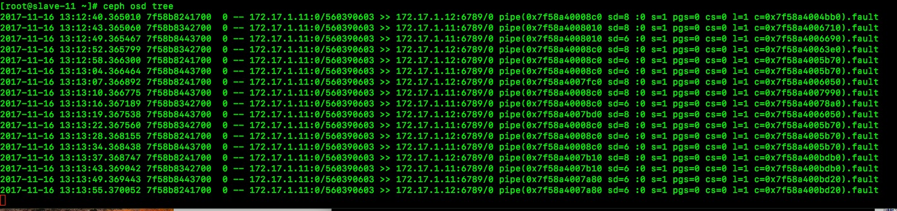

 
# ceph 日常问题汇总

## 删除mon
      1. 停止监视器  
        service  ceph -a  stop  mon.{mon-id}
        
      2. 从集群中删除监视器
         ceph  mon remove {mon-id}     
## 添加mon 
      
      1. 在新监视器上创建默认目录    
           mkdir   /var/lib/ceph/mon/ceph-{mon-id}       
      
      2. 创建临时目录{tmp},用以保存此过程中用到的文件。此目录要不同于此前创建监视器数据目录，且完成后可删除。  
           mkdir  {tmp}   
      
      3. 获取监视器密钥环文件保存路径、{filename}是包含密钥的文件名 
          ceph  auth  get mon. -o {tmp}/{key-filename}
      
      4. 获取监视器运行图，{tmp}是获取到的监视器运行图、{filename}是包含监视器运行图的文件名 
          ceph   mon  getmap  -o {tmp}/{map-filename}
      
      5. 准备第一步创建的监视器数据目录。必须指定监视器运行图路径，这样才能获得监视器法定人数和它们fsid 的信息；还要指定监视器密钥环路径。 
         ceph-mon  -i {mon-id}  --mkfs --monmap {tmp}/{map-filename}  --keyring  {tmp}/{key-filename} 
      
      6. 启动新监视器，它会自动加入机器。守护进程需知道绑定哪个地址，通过 --public-addr {ip:port} 或在ceph.conf里相应段设置 mon  addr 可以指定 
        ceph-mon  -i  {mon-id}  --public-addr  {ip:port}
        
## mon 启动失败解决 
    
    
    
    1. 查看ceph日志mon 启动失败，只有一台mon 运行正常
    2. 解决将运行好的mon 的/var/lib/ceph/mon/{mon-id}/ 
       keyring  store.db 
       同步到mon启动失败主机上,然后启动mon service  ceph  start mon 启动   
       
## ceph 添加硬盘
     ceph-disk prepare --cluster ceph --cluster-uuid AQAhnlJZ0cBXMhAAjDhVcO81T9ScBJBpMMlb1Q== --fs-type xfs /dev/vdd     
       
       
      
         
        
        
         
         
             
          
     
     
       
      